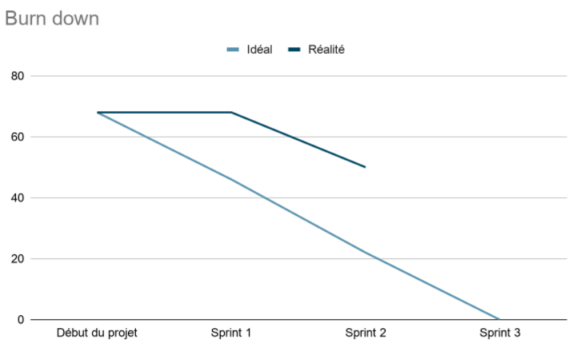

## Planification du Sprint 2

### User Stories

| ID | US Description | Importance | Difficulté  | statut
|:--:|----------------|:----------:|:-----------:|:----------:
| 01   | En tant que visiteur, je souhaite pouvoir créer un compte en renseignant une adresse mail, un pseudonyme, un mot de passe et une confirmation du mot de passe afin de créer et de gérer mes projets. Toutes les informations à renseigner sont obligatoires. | normale | 2    | Fermée |
| 02   | En tant qu'utilisateur, je souhaite pouvoir me connecter à mon compte en renseignant mon e-mail et mot de passe afin d'avoir accès à mes projets. | normale | 2    | Fermée |
| 03   | En tant qu'utilisateur, je souhaite pouvoir créer un projet en renseignant un nom (obligatoire) et une description (optionnel) afin de pouvoir faire une gestion agile sur mon projet. | maximale | 2    | Fermée |
| 04   | En tant qu'utilisateur, je souhaite effectuer une recherche dans la liste de projets auxquels je participe en fonction de leur nom afin de retrouver facilement un projet qui m'intéresse. | normale | 2    | Fermée |
|05 | En tant qu'utilisateur, je souhaite accéder à une liste de mes projets contenant comme champs le nom du projet, sa description courte et le propriétaire du projet afin de pouvoir accéder au projet qui m'intéresse | maximale | 2 | Fermée|
|09 | En tant que membre d'un projet, je souhaite pouvoir créer une User Story en renseignant sa description (obligatoire), sa priorité et sa difficulté afin de pouvoir constituer un backlog. | maximale |     3      | Fermée|
|10 | En tant que membre d'un projet, je souhaite pouvoir modifier ou supprimer des User Stories afin de pouvoir corriger d'éventuelles erreurs. | maximale |     3      | Fermée|
|11 | En tant que membre d'un projet, je souhaite accéder au backlog contenant la liste de toutes les User Stories avec les champs description, identifiant, importance et difficulté afin de pouvoir les gérer (modification, suppression, tri). | maximale | 2 | Fermée|
|26 | En tant que membre d'un projet, je souhaite pouvoir me déplacer entre les differentes fonctionnalités (projets, backlog, sprints, tâches) en utilisant un menu afin de faciliter l'utilisation de l'application. | normale | 3 | Ouverte |

### Conclusion du Sprint 2

- Prévision de charge: 21
- Vélocité: 18

### Burndown

fin du sprint 2

